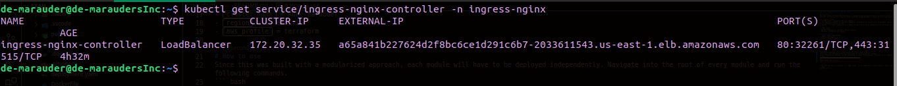
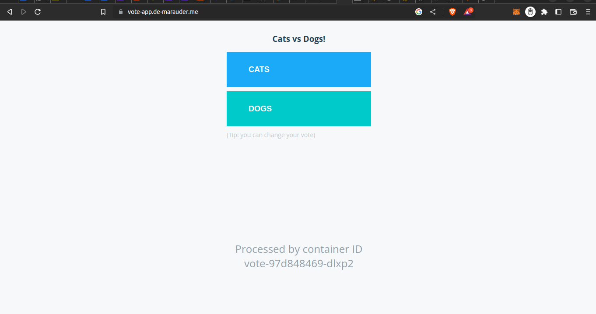
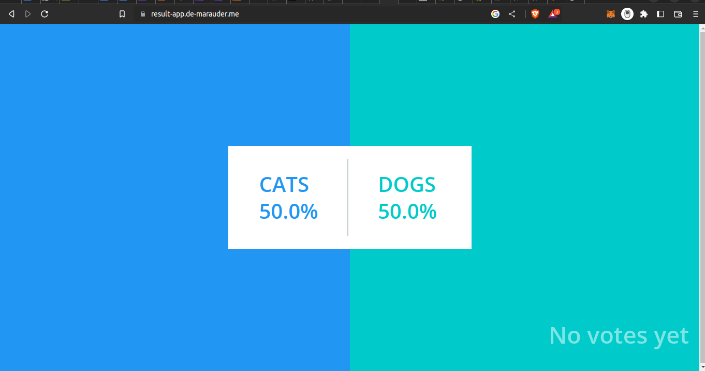
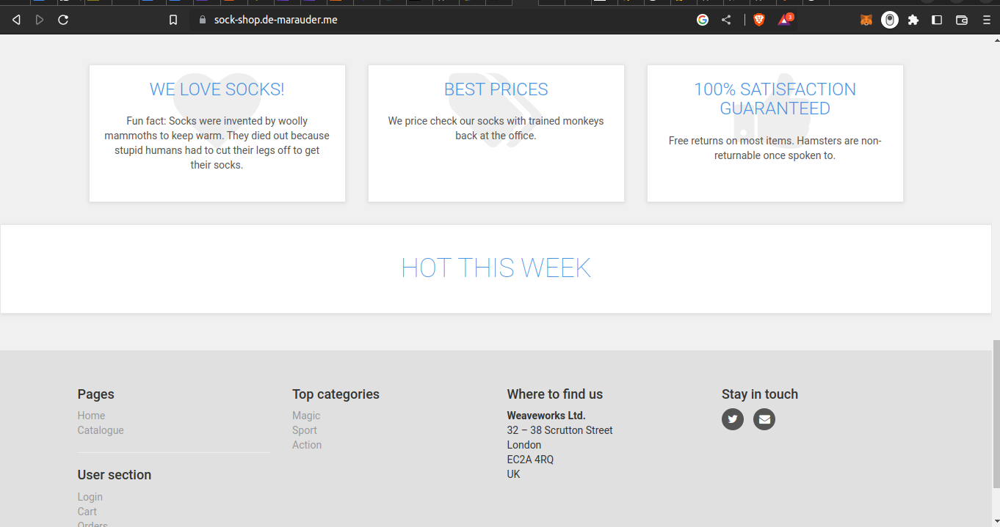
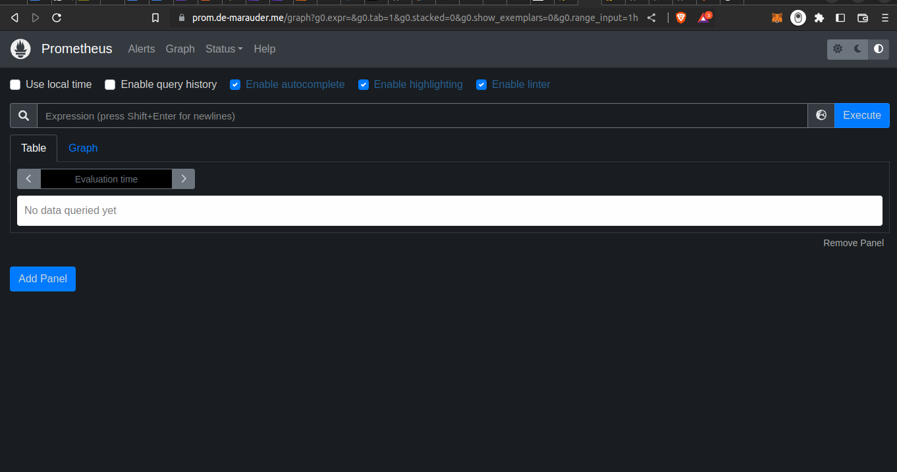
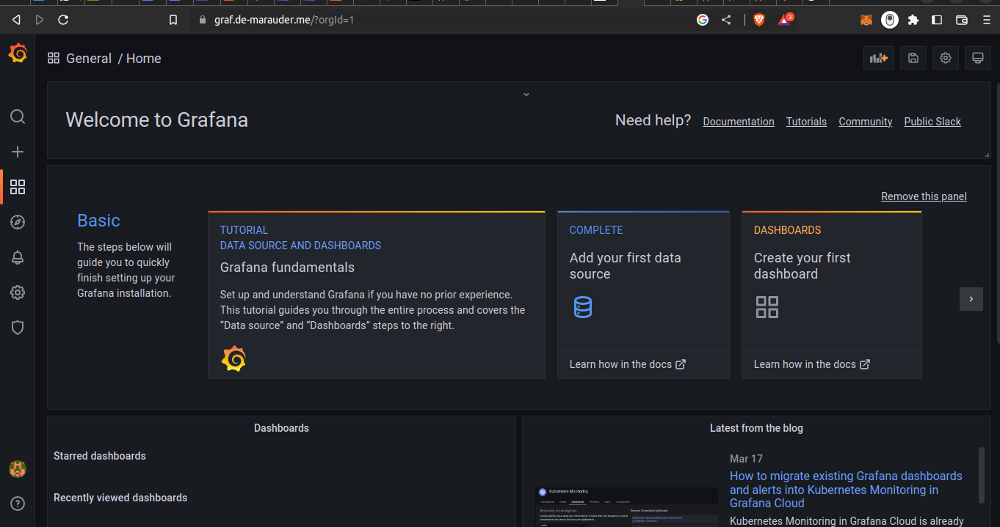

# Provision 3 application on an AWS EKS cluster

## Description
This repo contains terraform code to provision and manage three separate applications on a kubernetes cluster using AWS EKS. The components of the infrasture are split up into 3 separate modules which are invoked separately to reduce the size of the state file and boost build times.
The applications include:
- My portfolio: [de-marauder.me](https://de-marauder.me)
- A [voting application](https://github.com/dockersamples/example-voting-app) on [vote-app.de-marauder.me](https://vote-app.de-marauder.me) and [result-app.de-marauder.me](https://result-app.de-marauder.me)
- The [weaveworks sock shop](https://github.com/microservices-demo/microservices-demo) application on [sock-shop.de-marauder.me](https://sock-shop.de-marauder.me)

The 3 modules include:
- `The EKS cluster`: Including a VPC and 6 subnets
- `The kubernetes manifests` for the entire deployment including but not limited to ssl certificates, ingress controllers, monitoring and logging tools such as prometheus, grafana and loki
- `Route53` - To create a hosted zone for a domain and map A records to the subdomains of the provisioned services it to the ingress controller.

## Requirements
- An AWS account
- AWS CLI configured for a terraform IAM user (default)
- terraform installed on your computer

### Default settings
- `cluster_name` = kube-marauder
- `region` = us-east-1
- `aws_profile` = terraform

### Default Domains
- My portfolio: [de-marauder.me](https://de-marauder.me)
- A voting application on [vote-app.de-marauder.me](https://vote-app.de-marauder.me) and [result-app.de-marauder.me](https://result-app.de-marauder.me)
- The weaveworks sock shop application on [sock-shop.de-marauder.me](https://sock-shop.de-marauder.me)
- Prometheus at [prom.de-marauder.me](https://prom.de-marauder.me)
- Grafana at [graf.de-marauder.me](https://graf.de-marauder.me)

# How to use
Since this was built with a modularized approach, each module will have to be deployed independently. Navigate into the root of every module and run the following commands. 
``` bash
terraform init
terraform plan
terraform apply
```

**NOTE Module dependency is as follows route53 > manifests > kube-cluster.**
**Therefore, start the kube-cluster first then deploy the manifests and then route53**
**After deploying the manifests, run the command below to obtain the loadbalancer name which will be requested by the route53 module**
```bash
kubectl get service/ingress-nginx-controller -n ingress-nginx
```
Result should look like this:

> The load balancer's name is the part of the load balancer DNS before the first hyphen (-). In this case `a65a841b227624d2f8bc6ce1d291c6b7`

---

> It's also important to note that if you're going to change the default sub-domains, you should equally update the manifest files for [ingress](manifests/ingress) and [certificates](manifests/certificates) to reflect the new domains.

# Clean up
In the event that the infrastructure is no longer needed, run the command below in every module in reverse order of creation to destroy the infrastructure.
```bash
terraform destroy
```

# Results





